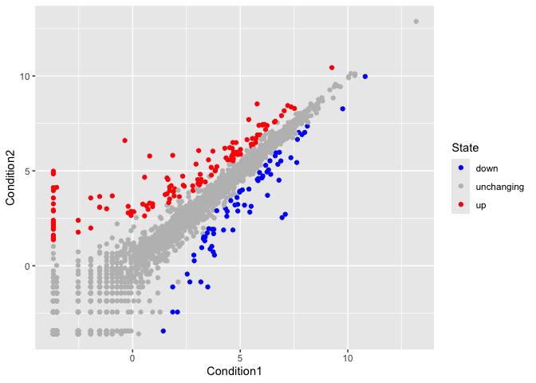

# class05 data vis w ggplot
amy (pid A16962111)

# graphics systems in R

There are many graphics systems in R for making plots and figures

We have already played a little with **“base R”** graphics and the
`plot()` function

Today we will start learning about a popular graphics package called
`ggplot2()`

## This is an add on package - i.e. we need to install it. I install it (like I install any package) with the `install.packages()` function

``` r
plot(cars)
```


Before I can use the functions from a package, I have to load up the
package from my “library”. We use the `library(ggplot2)` command to load
it up.

``` r
# install.packages(ggplot2)
library(ggplot2)
ggplot(cars)
```


Every ggplot is made up of at least 3 things:

-   data (the numbers etc. that will go into your plot)

-   aes (how the columns of data map to the plot aesthetics)

-   geoms (how the plot actually looks; points, bars, lines, etc)

    ``` r
    ggplot(cars) +
      aes(x=speed, y=dist) +
      geom_point()
    ```

    

For simple plots ggplot is more verbose - it takes more code than base R
plot.

Add some more layers to our ggplot:

``` r
ggplot(cars) +
  aes(x=speed, y=dist) +
  geom_point() +
  geom_smooth(method = "lm", se=FALSE) +
  labs(title = "stopping distance of old cars", 
       subtitle = "a silly example plot",
       x="speed (mph)",
       y="stopping distance (ft)",
       caption="dataset: cars") +
  theme_bw()
```

    `geom_smooth()` using formula = 'y ~ x'


# gene expression example

``` r
url <- "https://bioboot.github.io/bimm143_S20/class-material/up_down_expression.txt"
genes <- read.delim(url)
head(genes)
```

            Gene Condition1 Condition2      State
    1      A4GNT -3.6808610 -3.4401355 unchanging
    2       AAAS  4.5479580  4.3864126 unchanging
    3      AASDH  3.7190695  3.4787276 unchanging
    4       AATF  5.0784720  5.0151916 unchanging
    5       AATK  0.4711421  0.5598642 unchanging
    6 AB015752.4 -3.6808610 -3.5921390 unchanging

``` r
nrow(genes)
```

    [1] 5196

``` r
ncol(genes)
```

    [1] 4

``` r
table(genes$State)
```


          down unchanging         up 
            72       4997        127 

``` r
round(table(genes$State)/nrow(genes)*100, 2)
```


          down unchanging         up 
          1.39      96.17       2.44 

``` r
ggplot(genes) + 
  aes(x=Condition1, y=Condition2) +
  geom_point()
```


``` r
p <- ggplot(genes) + 
  aes(x=Condition1, y=Condition2, col=State) +
  geom_point()
p
```


``` r
p + scale_colour_manual( values=c("blue","gray","red") )
```



``` r
p + scale_colour_manual( values=c("blue","gray","red") ) +
  labs(title = "gene expression changes upon drug treatment",
         x="control (no drug)",
         y="drug treatment")
```


# gapminder example

``` r
# install.packages("gapminder", repos="http://cran.us.r-project.org")
library(gapminder)
# install.packages("dplyr", repos = "http://cran.us.r-project.org")
library(dplyr)
```


    Attaching package: 'dplyr'

    The following objects are masked from 'package:stats':

        filter, lag

    The following objects are masked from 'package:base':

        intersect, setdiff, setequal, union

``` r
gapminder_2007 <- gapminder %>% filter(year==2007)
```

``` r
ggplot(gapminder_2007) +
  aes(x=gdpPercap, y=lifeExp) +
  geom_point()
```


``` r
ggplot(gapminder_2007) +
  aes(x=gdpPercap, y=lifeExp, size=pop, color=continent) +
  geom_point(alpha=0.5)
```


``` r
ggplot(gapminder_2007) + 
  aes(x = gdpPercap, y = lifeExp, color = pop) +
  geom_point(alpha=0.8)
```


``` r
ggplot(gapminder_2007) + 
  aes(x = gdpPercap, y = lifeExp, size = pop) +
  geom_point(alpha=0.5)
```


``` r
ggplot(gapminder_2007) + 
  geom_point(aes(x = gdpPercap, y = lifeExp,
                 size = pop), alpha=0.5) + 
  scale_size_area(max_size = 10)
```


``` r
gapminder_1957 <- gapminder %>% filter(year==1957)
ggplot(gapminder_1957) +
  aes(x=gdpPercap, y=lifeExp, size=pop, color=continent) +
  geom_point(alpha=0.7) +
  scale_size_area(max_size = 10) 
```


``` r
gapminder_1957_2007 <- gapminder %>% filter(year==1957 | year==2007)

ggplot(gapminder_1957_2007) + 
  geom_point(aes(x = gdpPercap, y = lifeExp, color=continent,
                 size = pop), alpha=0.7) + 
  scale_size_area(max_size = 10) +
  facet_wrap(~year)
```


