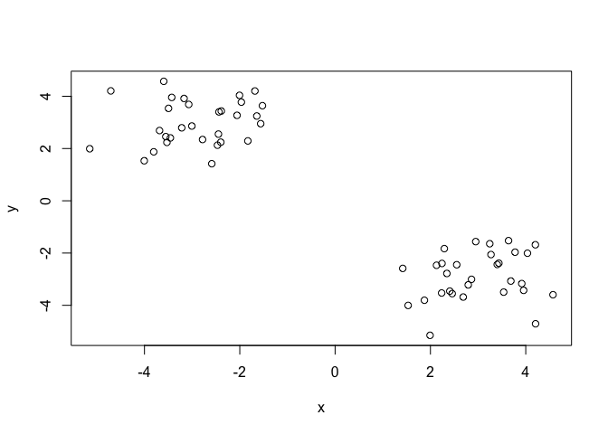
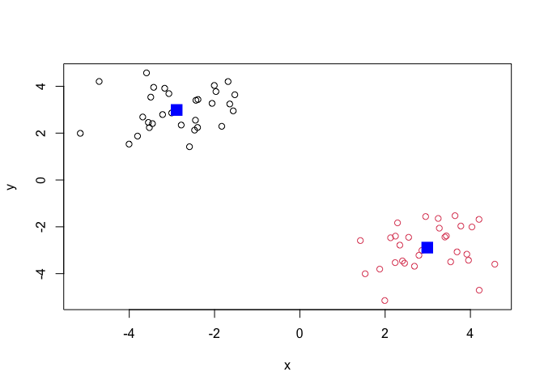
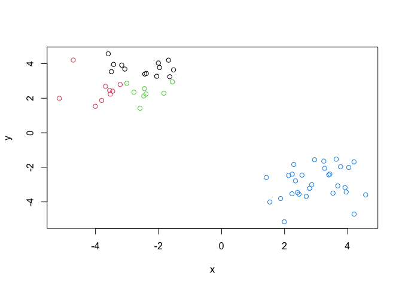
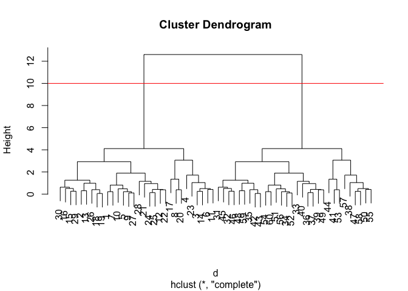
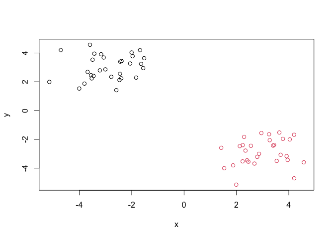
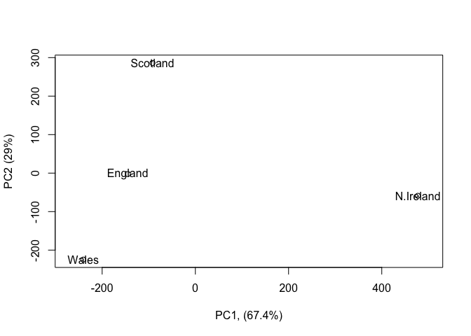
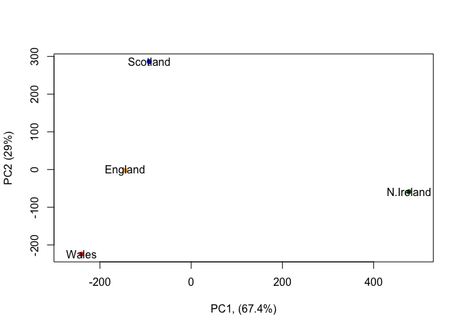
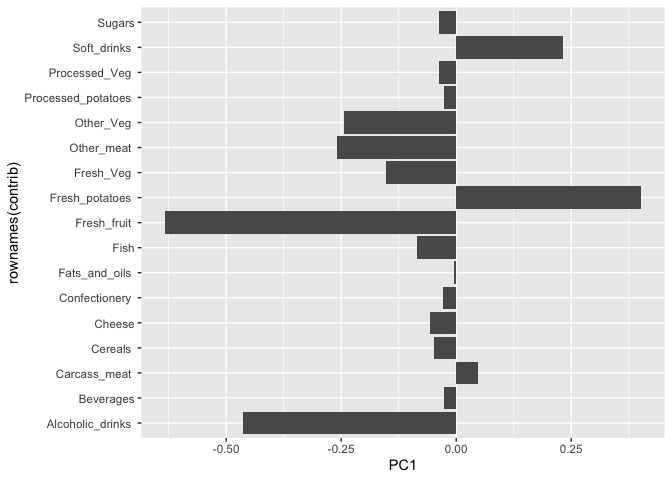

# class07 machine learning
amy (pid A16962111)

# clustering methods

The broad goal here is to find groupings (clusters) in your input data.

## kmeans

First, let’s make up some data to cluster. Make a vector of length 60
with 30 points centered on -3 and 30 points at +3.

``` r
tmp <- c(rnorm(30, mean=-3), rnorm(30, mean=3))
```

I will now make a x,y dataset with 2 groups of points.

``` r
x <- cbind(x=tmp, y=rev(tmp))
plot(x)
```



``` r
k <- kmeans(x, centers=2)
k
```

    K-means clustering with 2 clusters of sizes 30, 30

    Cluster means:
              x         y
    1 -2.888441  2.988094
    2  2.988094 -2.888441

    Clustering vector:
     [1] 1 1 1 1 1 1 1 1 1 1 1 1 1 1 1 1 1 1 1 1 1 1 1 1 1 1 1 1 1 1 2 2 2 2 2 2 2 2
    [39] 2 2 2 2 2 2 2 2 2 2 2 2 2 2 2 2 2 2 2 2 2 2

    Within cluster sum of squares by cluster:
    [1] 46.16785 46.16785
     (between_SS / total_SS =  91.8 %)

    Available components:

    [1] "cluster"      "centers"      "totss"        "withinss"     "tot.withinss"
    [6] "betweenss"    "size"         "iter"         "ifault"      

> Q. From your result object `k` how many points are in each cluster?

``` r
k$size
```

    [1] 30 30

> Q. What “component” of your result object details the cluster
> membership?

``` r
k$cluster
```

     [1] 1 1 1 1 1 1 1 1 1 1 1 1 1 1 1 1 1 1 1 1 1 1 1 1 1 1 1 1 1 1 2 2 2 2 2 2 2 2
    [39] 2 2 2 2 2 2 2 2 2 2 2 2 2 2 2 2 2 2 2 2 2 2

> Q. Cluster centers?

``` r
k$centers
```

              x         y
    1 -2.888441  2.988094
    2  2.988094 -2.888441

> Q. Plot of our clustering results

``` r
plot(x, col=k$cluster)
points(k$centers, col="blue", pch=15, cex=2)
```



We can cluster into 4 grps:

``` r
k2 <- kmeans(x, centers=4)
plot(x, col=k2$cluster)
```



A big limitation of kmeans is that it does what you ask even if you ask
for silly clusters.

## hierarchical clustering

The main base R function for hierarchical clustering is `hclust()` .
Unlike `kmeans()`, you can not just pass it your data as input. You
first need to calculate a distance matrix.

``` r
d <- dist(x)
hc <- hclust(d)
plot(hc)
abline(h=10, col="red")
```



To make the “cut” and get our cluster membership vector, we can use the
`cutree()` function.

``` r
grps <- cutree(hc, h=10)
grps
```

     [1] 1 1 1 1 1 1 1 1 1 1 1 1 1 1 1 1 1 1 1 1 1 1 1 1 1 1 1 1 1 1 2 2 2 2 2 2 2 2
    [39] 2 2 2 2 2 2 2 2 2 2 2 2 2 2 2 2 2 2 2 2 2 2

``` r
plot(x, col=grps)
```



# Principal Component Analysis (PCA)

Here we will do PCA of UK food data:

``` r
url <- "https://tinyurl.com/UK-foods"
x <- read.csv(url, row.names=1)
#View(x)
```

> **Q1**. How many rows and columns are in your new data frame
> named `x`? What R functions could you use to answer this questions?

``` r
nrow(x)
```

    [1] 17

``` r
ncol(x)
```

    [1] 4

``` r
head(x)
```

                   England Wales Scotland N.Ireland
    Cheese             105   103      103        66
    Carcass_meat       245   227      242       267
    Other_meat         685   803      750       586
    Fish               147   160      122        93
    Fats_and_oils      193   235      184       209
    Sugars             156   175      147       139

> **Q2.** Which approach to solving the ‘row-names problem’ mentioned
> above do you prefer and why? Is one approach more robust than another
> under certain circumstances?

``` r
#rownames(x) <- x[,1]
#x <- x[,-1]
#head(x)
```

I prefer `row.names=1` , since running the code above more than once
would continue to remove columns of data.

> **Q3**: Changing what optional argument in the
> above **barplot()** function results in the following plot?

Changing `beside=T` to `beside=F`.

``` r
barplot(as.matrix(x), beside=T, col=rainbow(nrow(x)))
```


``` r
barplot(as.matrix(x), beside=F, col=rainbow(nrow(x)))
```


> **Q5**: Generating all pairwise plots may help somewhat. Can you make
> sense of the following code and resulting figure? What does it mean if
> a given point lies on the diagonal for a given plot?

If a point lies on the diagonal, it indicates that value is similar to
the other observations for that variable.

``` r
pairs(x, col=rainbow(10), pch=16)
```


``` r
#?pairs
```

> **Q6**. What is the main differences between N. Ireland and the other
> countries of the UK in terms of this data-set?

It looks like the blue and orange points are different between N.
Ireland and the other countries of the UK.

## PCA to the rescue

The main “base” R function for PCA is called `prcomp()`. Here we need to
take the transpose of our input, as we want the countries in the rows
and the food as the columns.

``` r
pca <- prcomp(t(x))
summary(pca)
```

    Importance of components:
                                PC1      PC2      PC3       PC4
    Standard deviation     324.1502 212.7478 73.87622 3.176e-14
    Proportion of Variance   0.6744   0.2905  0.03503 0.000e+00
    Cumulative Proportion    0.6744   0.9650  1.00000 1.000e+00

> Q. How much variance is captured in 2 PCs?

96.5%

> **Q7**. Complete the code below to generate a plot of PC1 vs PC2. The
> second line adds text labels over the data points.

To make our main “PC score plot” or “PC1 vs PC2 plot” or “PC plot” or
“ordination plot”:

``` r
attributes(pca)
```

    $names
    [1] "sdev"     "rotation" "center"   "scale"    "x"       

    $class
    [1] "prcomp"

We are after the `pca$x` result component to make our main PCA plot.

``` r
plot(pca$x[,1], pca$x[,2], xlab="PC1, (67.4%)", ylab="PC2 (29%)", xlim=c(-270,500))
text(pca$x[,1], pca$x[,2], colnames(x))
```



**Q8.** Customize your plot so that the colors of the country names
match the colors in our UK and Ireland map and table at start of this
document.

``` r
mycols <- c("orange", "red", "blue", "darkgreen")
plot(pca$x[,1], pca$x[,2], xlab="PC1, (67.4%)", ylab="PC2 (29%)", xlim=c(-270,500),
     col=mycols, pch=16)
text(pca$x[,1], pca$x[,2], colnames(x))
```



Another important result from PCA is how the original variables (in this
case, the foods) contribute to the PCs.

This is contained in the `pca$rotation` object - folks often call this
the “loadings” or “contributions” to the PCs.

``` r
pca$rotation
```

                                 PC1          PC2         PC3          PC4
    Cheese              -0.056955380  0.016012850  0.02394295 -0.694538519
    Carcass_meat         0.047927628  0.013915823  0.06367111  0.489884628
    Other_meat          -0.258916658 -0.015331138 -0.55384854  0.279023718
    Fish                -0.084414983 -0.050754947  0.03906481 -0.008483145
    Fats_and_oils       -0.005193623 -0.095388656 -0.12522257  0.076097502
    Sugars              -0.037620983 -0.043021699 -0.03605745  0.034101334
    Fresh_potatoes       0.401402060 -0.715017078 -0.20668248 -0.090972715
    Fresh_Veg           -0.151849942 -0.144900268  0.21382237 -0.039901917
    Other_Veg           -0.243593729 -0.225450923 -0.05332841  0.016719075
    Processed_potatoes  -0.026886233  0.042850761 -0.07364902  0.030125166
    Processed_Veg       -0.036488269 -0.045451802  0.05289191 -0.013969507
    Fresh_fruit         -0.632640898 -0.177740743  0.40012865  0.184072217
    Cereals             -0.047702858 -0.212599678 -0.35884921  0.191926714
    Beverages           -0.026187756 -0.030560542 -0.04135860  0.004831876
    Soft_drinks          0.232244140  0.555124311 -0.16942648  0.103508492
    Alcoholic_drinks    -0.463968168  0.113536523 -0.49858320 -0.316290619
    Confectionery       -0.029650201  0.005949921 -0.05232164  0.001847469

We can make a plot along PC1.

``` r
library(ggplot2)
contrib <- as.data.frame(pca$rotation)
ggplot(contrib) +
  aes(PC1, rownames(contrib)) +
  geom_col()
```


