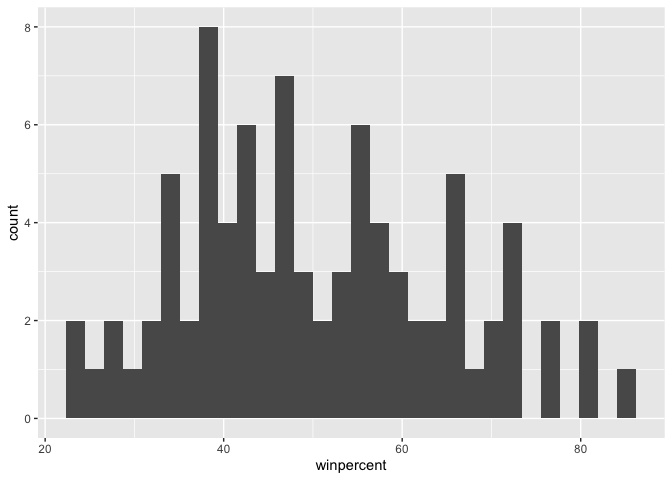
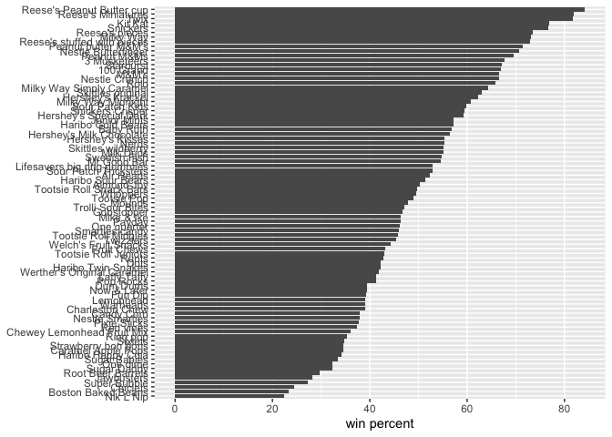
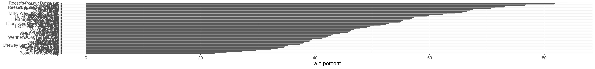
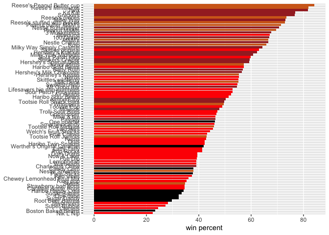
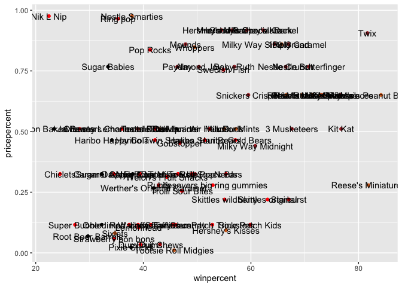
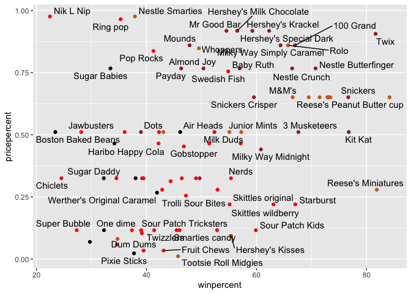
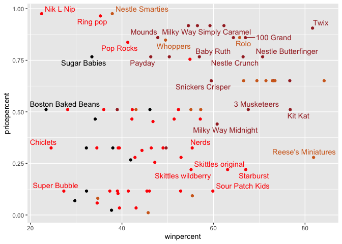
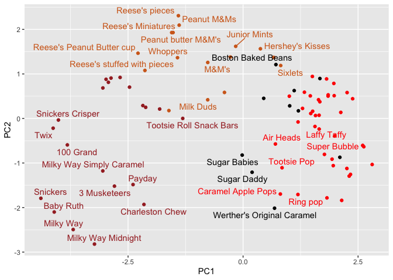

# class09 halloween candy
amy (pid A16962111)

Here we analyze a candy dataset from the 538 website. This is a CSV file
from their GitHub repository.

## data import

``` r
candy_file <- "candy-data.csv"

candy = read.csv(candy_file, row.names=1)
head(candy)
```

                 chocolate fruity caramel peanutyalmondy nougat crispedricewafer
    100 Grand            1      0       1              0      0                1
    3 Musketeers         1      0       0              0      1                0
    One dime             0      0       0              0      0                0
    One quarter          0      0       0              0      0                0
    Air Heads            0      1       0              0      0                0
    Almond Joy           1      0       0              1      0                0
                 hard bar pluribus sugarpercent pricepercent winpercent
    100 Grand       0   1        0        0.732        0.860   66.97173
    3 Musketeers    0   1        0        0.604        0.511   67.60294
    One dime        0   0        0        0.011        0.116   32.26109
    One quarter     0   0        0        0.011        0.511   46.11650
    Air Heads       0   0        0        0.906        0.511   52.34146
    Almond Joy      0   1        0        0.465        0.767   50.34755

## data exploration

-   **Q1**. How many different candy types are in this dataset?

    85 candy types

    ``` r
    nrow(candy)
    ```

        [1] 85

-   **Q2**. How many fruity candy types are in the dataset?

    38 fruity candies

    ``` r
    sum(candy$fruity)
    ```

        [1] 38

<!-- -->

-   **Q3**. What is your favorite candy in the dataset and what is
    it’s `winpercent` value?

    ``` r
    candy["Milk Duds",]$winpercent
    ```

        [1] 55.06407

-   **Q4**. What is the `winpercent` value for “Kit Kat”?

    ``` r
    candy["Kit Kat",]$winpercent
    ```

        [1] 76.7686

-   **Q5**. What is the `winpercent` value for “Tootsie Roll Snack
    Bars”?

    ``` r
    candy["Tootsie Roll Snack Bars",]$winpercent
    ```

        [1] 49.6535

``` r
#install.packages("skimr")
library("skimr")
skim(candy)
```

<table>
<caption>Data summary</caption>
<tbody>
<tr class="odd">
<td style="text-align: left;">Name</td>
<td style="text-align: left;">candy</td>
</tr>
<tr class="even">
<td style="text-align: left;">Number of rows</td>
<td style="text-align: left;">85</td>
</tr>
<tr class="odd">
<td style="text-align: left;">Number of columns</td>
<td style="text-align: left;">12</td>
</tr>
<tr class="even">
<td style="text-align: left;">_______________________</td>
<td style="text-align: left;"></td>
</tr>
<tr class="odd">
<td style="text-align: left;">Column type frequency:</td>
<td style="text-align: left;"></td>
</tr>
<tr class="even">
<td style="text-align: left;">numeric</td>
<td style="text-align: left;">12</td>
</tr>
<tr class="odd">
<td style="text-align: left;">________________________</td>
<td style="text-align: left;"></td>
</tr>
<tr class="even">
<td style="text-align: left;">Group variables</td>
<td style="text-align: left;">None</td>
</tr>
</tbody>
</table>

Data summary

**Variable type: numeric**

<table style="width:100%;">
<colgroup>
<col style="width: 19%" />
<col style="width: 11%" />
<col style="width: 15%" />
<col style="width: 6%" />
<col style="width: 6%" />
<col style="width: 6%" />
<col style="width: 6%" />
<col style="width: 6%" />
<col style="width: 6%" />
<col style="width: 6%" />
<col style="width: 6%" />
</colgroup>
<thead>
<tr class="header">
<th style="text-align: left;">skim_variable</th>
<th style="text-align: right;">n_missing</th>
<th style="text-align: right;">complete_rate</th>
<th style="text-align: right;">mean</th>
<th style="text-align: right;">sd</th>
<th style="text-align: right;">p0</th>
<th style="text-align: right;">p25</th>
<th style="text-align: right;">p50</th>
<th style="text-align: right;">p75</th>
<th style="text-align: right;">p100</th>
<th style="text-align: left;">hist</th>
</tr>
</thead>
<tbody>
<tr class="odd">
<td style="text-align: left;">chocolate</td>
<td style="text-align: right;">0</td>
<td style="text-align: right;">1</td>
<td style="text-align: right;">0.44</td>
<td style="text-align: right;">0.50</td>
<td style="text-align: right;">0.00</td>
<td style="text-align: right;">0.00</td>
<td style="text-align: right;">0.00</td>
<td style="text-align: right;">1.00</td>
<td style="text-align: right;">1.00</td>
<td style="text-align: left;">▇▁▁▁▆</td>
</tr>
<tr class="even">
<td style="text-align: left;">fruity</td>
<td style="text-align: right;">0</td>
<td style="text-align: right;">1</td>
<td style="text-align: right;">0.45</td>
<td style="text-align: right;">0.50</td>
<td style="text-align: right;">0.00</td>
<td style="text-align: right;">0.00</td>
<td style="text-align: right;">0.00</td>
<td style="text-align: right;">1.00</td>
<td style="text-align: right;">1.00</td>
<td style="text-align: left;">▇▁▁▁▆</td>
</tr>
<tr class="odd">
<td style="text-align: left;">caramel</td>
<td style="text-align: right;">0</td>
<td style="text-align: right;">1</td>
<td style="text-align: right;">0.16</td>
<td style="text-align: right;">0.37</td>
<td style="text-align: right;">0.00</td>
<td style="text-align: right;">0.00</td>
<td style="text-align: right;">0.00</td>
<td style="text-align: right;">0.00</td>
<td style="text-align: right;">1.00</td>
<td style="text-align: left;">▇▁▁▁▂</td>
</tr>
<tr class="even">
<td style="text-align: left;">peanutyalmondy</td>
<td style="text-align: right;">0</td>
<td style="text-align: right;">1</td>
<td style="text-align: right;">0.16</td>
<td style="text-align: right;">0.37</td>
<td style="text-align: right;">0.00</td>
<td style="text-align: right;">0.00</td>
<td style="text-align: right;">0.00</td>
<td style="text-align: right;">0.00</td>
<td style="text-align: right;">1.00</td>
<td style="text-align: left;">▇▁▁▁▂</td>
</tr>
<tr class="odd">
<td style="text-align: left;">nougat</td>
<td style="text-align: right;">0</td>
<td style="text-align: right;">1</td>
<td style="text-align: right;">0.08</td>
<td style="text-align: right;">0.28</td>
<td style="text-align: right;">0.00</td>
<td style="text-align: right;">0.00</td>
<td style="text-align: right;">0.00</td>
<td style="text-align: right;">0.00</td>
<td style="text-align: right;">1.00</td>
<td style="text-align: left;">▇▁▁▁▁</td>
</tr>
<tr class="even">
<td style="text-align: left;">crispedricewafer</td>
<td style="text-align: right;">0</td>
<td style="text-align: right;">1</td>
<td style="text-align: right;">0.08</td>
<td style="text-align: right;">0.28</td>
<td style="text-align: right;">0.00</td>
<td style="text-align: right;">0.00</td>
<td style="text-align: right;">0.00</td>
<td style="text-align: right;">0.00</td>
<td style="text-align: right;">1.00</td>
<td style="text-align: left;">▇▁▁▁▁</td>
</tr>
<tr class="odd">
<td style="text-align: left;">hard</td>
<td style="text-align: right;">0</td>
<td style="text-align: right;">1</td>
<td style="text-align: right;">0.18</td>
<td style="text-align: right;">0.38</td>
<td style="text-align: right;">0.00</td>
<td style="text-align: right;">0.00</td>
<td style="text-align: right;">0.00</td>
<td style="text-align: right;">0.00</td>
<td style="text-align: right;">1.00</td>
<td style="text-align: left;">▇▁▁▁▂</td>
</tr>
<tr class="even">
<td style="text-align: left;">bar</td>
<td style="text-align: right;">0</td>
<td style="text-align: right;">1</td>
<td style="text-align: right;">0.25</td>
<td style="text-align: right;">0.43</td>
<td style="text-align: right;">0.00</td>
<td style="text-align: right;">0.00</td>
<td style="text-align: right;">0.00</td>
<td style="text-align: right;">0.00</td>
<td style="text-align: right;">1.00</td>
<td style="text-align: left;">▇▁▁▁▂</td>
</tr>
<tr class="odd">
<td style="text-align: left;">pluribus</td>
<td style="text-align: right;">0</td>
<td style="text-align: right;">1</td>
<td style="text-align: right;">0.52</td>
<td style="text-align: right;">0.50</td>
<td style="text-align: right;">0.00</td>
<td style="text-align: right;">0.00</td>
<td style="text-align: right;">1.00</td>
<td style="text-align: right;">1.00</td>
<td style="text-align: right;">1.00</td>
<td style="text-align: left;">▇▁▁▁▇</td>
</tr>
<tr class="even">
<td style="text-align: left;">sugarpercent</td>
<td style="text-align: right;">0</td>
<td style="text-align: right;">1</td>
<td style="text-align: right;">0.48</td>
<td style="text-align: right;">0.28</td>
<td style="text-align: right;">0.01</td>
<td style="text-align: right;">0.22</td>
<td style="text-align: right;">0.47</td>
<td style="text-align: right;">0.73</td>
<td style="text-align: right;">0.99</td>
<td style="text-align: left;">▇▇▇▇▆</td>
</tr>
<tr class="odd">
<td style="text-align: left;">pricepercent</td>
<td style="text-align: right;">0</td>
<td style="text-align: right;">1</td>
<td style="text-align: right;">0.47</td>
<td style="text-align: right;">0.29</td>
<td style="text-align: right;">0.01</td>
<td style="text-align: right;">0.26</td>
<td style="text-align: right;">0.47</td>
<td style="text-align: right;">0.65</td>
<td style="text-align: right;">0.98</td>
<td style="text-align: left;">▇▇▇▇▆</td>
</tr>
<tr class="even">
<td style="text-align: left;">winpercent</td>
<td style="text-align: right;">0</td>
<td style="text-align: right;">1</td>
<td style="text-align: right;">50.32</td>
<td style="text-align: right;">14.71</td>
<td style="text-align: right;">22.45</td>
<td style="text-align: right;">39.14</td>
<td style="text-align: right;">47.83</td>
<td style="text-align: right;">59.86</td>
<td style="text-align: right;">84.18</td>
<td style="text-align: left;">▃▇▆▅▂</td>
</tr>
</tbody>
</table>

-   **Q.** What is the least-liked candy in the dataset?

    Nik L Nip

    ``` r
    row.names(candy[which.min(candy$winpercent),])
    ```

        [1] "Nik L Nip"

-   **Q6**. Is there any variable/column that looks to be on a different
    scale to the majority of the other columns in the dataset?

    winpercent

-   **Q7**. What do you think a zero and one represent for
    the `candy$chocolate` column?

    A zero represents a `FALSE` and a one represents `TRUE`

<!-- -->

-   **Q8**. Plot a histogram of `winpercent` values

    ``` r
    library(ggplot2)
    ggplot(candy) +
      aes(winpercent) +
      geom_histogram()
    ```

        `stat_bin()` using `bins = 30`. Pick better value with `binwidth`.

    

-   **Q9**. Is the distribution of `winpercent` values symmetrical?

    No, slight right skew

-   **Q10**. Is the center of the distribution above or below 50%?

    below

-   **Q11**. On average is chocolate candy higher or lower ranked than
    fruit candy?

    chocolate candy is higher ranked

    ``` r
    #winpercent for chocolate candy
    choco <- candy$winpercent[candy$chocolate==1]
    # winpercent for fruity candy
    fruit <- candy$winpercent[candy$fruity==1]
    #is the mean chocolate winpercent greater than mean fruity winpercent?
    mean(choco) > mean(fruit)
    ```

        [1] TRUE

-   **Q12**. Is this difference statistically significant?

    yes, pvalue \< 0.0001

    ``` r
    t.test(choco, y=fruit)
    ```


            Welch Two Sample t-test

        data:  choco and fruit
        t = 6.2582, df = 68.882, p-value = 2.871e-08
        alternative hypothesis: true difference in means is not equal to 0
        95 percent confidence interval:
         11.44563 22.15795
        sample estimates:
        mean of x mean of y 
         60.92153  44.11974 

## overall candy rankings

-   **Q13**. What are the five least liked candy types in this set?

    Nik L Nip, Boston Baked Bean, Chiclets, Super Bubble, Jawbusters

    ``` r
    library(dplyr)
    ```


        Attaching package: 'dplyr'

        The following objects are masked from 'package:stats':

            filter, lag

        The following objects are masked from 'package:base':

            intersect, setdiff, setequal, union

    ``` r
    candy %>%
      arrange(winpercent) %>%
      head(5) %>%
      row.names()
    ```

        [1] "Nik L Nip"          "Boston Baked Beans" "Chiclets"          
        [4] "Super Bubble"       "Jawbusters"        

-   **Q14**. What are the top 5 all time favorite candy types out of
    this set?

    Reese’s Peanut Butter cup, Reese’s Miniatures, Twix, Kit Kat,
    Snickers

    ``` r
    row.names(head(candy[order(candy$winpercent, decreasing=TRUE),], n=5))
    ```

        [1] "Reese's Peanut Butter cup" "Reese's Miniatures"       
        [3] "Twix"                      "Kit Kat"                  
        [5] "Snickers"                 

<!-- -->

-   library(dplyr)candy %\>% arrange(winpercent) %\>% head(5) %\>%
    row.names()**Q15**. Make a first barplot of candy ranking based
    on `winpercent` values.

    ``` r
    ggplot(candy) +
      aes(winpercent, rownames(candy)) +
      geom_col()
    ```

    

<!-- -->

-   **Q16**. This is quite ugly, use the `reorder()` function to get the
    bars sorted by `winpercent`?

    ``` r
    ggplot(candy) +
      aes(winpercent, reorder(rownames(candy), winpercent)) +
      geom_col() +
      labs(x="win percent", y=NULL)
    ```

    

    ``` r
    ggsave("barplot1.png", width=17, height=2)
    ```

You can insert any image using this markdown syntax: \

``` markdown

```

Add some color to our ggplot.

``` r
my_cols=rep("black", nrow(candy))
my_cols[as.logical(candy$chocolate)] = "chocolate"
my_cols[as.logical(candy$bar)] = "brown"
my_cols[as.logical(candy$fruity)] = "red"
```

``` r
ggplot(candy) +
  aes(winpercent, reorder(rownames(candy), winpercent)) +
  geom_col(fill=my_cols) +
  labs(x="win percent", y=NULL)
```



-   **Q17**. What is the worst ranked chocolate candy?

    Sixlets

-   **Q18**. What is the best ranked fruity candy?

    Starburst

## taking a look at pricepercent

``` r
candy$pricepercent
```

     [1] 0.860 0.511 0.116 0.511 0.511 0.767 0.767 0.511 0.325 0.325 0.511 0.511
    [13] 0.325 0.511 0.034 0.034 0.325 0.453 0.465 0.465 0.465 0.465 0.093 0.918
    [25] 0.918 0.918 0.511 0.511 0.511 0.116 0.104 0.279 0.651 0.651 0.325 0.511
    [37] 0.651 0.441 0.860 0.860 0.918 0.325 0.767 0.767 0.976 0.325 0.767 0.651
    [49] 0.023 0.837 0.116 0.279 0.651 0.651 0.651 0.965 0.860 0.069 0.279 0.081
    [61] 0.220 0.220 0.976 0.116 0.651 0.651 0.116 0.116 0.220 0.058 0.767 0.325
    [73] 0.116 0.755 0.325 0.511 0.011 0.325 0.255 0.906 0.116 0.116 0.313 0.267
    [85] 0.848

If we want to see what is a good candy to buy in terms of winpercent and
pricepercent, we can plot these two variables and then see the best
candy for the least amount of money.

``` r
ggplot(candy) +
  aes(winpercent, pricepercent, label=rownames(candy)) +
  geom_point(col=my_cols) +
  geom_text()
```



to avoid overplotting the labels, we can use an add on package called
`ggrepel()`

``` r
#install.packages("ggrepel")
library(ggrepel)
```

``` r
ggplot(candy) +
  aes(winpercent, pricepercent, label=rownames(candy)) +
  geom_point(col=my_cols) +
  geom_text_repel()
```

    Warning: ggrepel: 29 unlabeled data points (too many overlaps). Consider
    increasing max.overlaps



Play with `max.overlaps()` parameter to `geom_text_repel()`

``` r
ggplot(candy) +
  aes(winpercent, pricepercent, label=rownames(candy)) +
  geom_point(col=my_cols) +
  geom_text_repel(max.overlaps=5, col=my_cols)
```

    Warning: ggrepel: 57 unlabeled data points (too many overlaps). Consider
    increasing max.overlaps



## exploring the correlation structure

``` r
#install.packages("corrplot")
library(corrplot)
```

    corrplot 0.92 loaded

``` r
cij <- cor(candy)
corrplot(cij)
```


-   **Q22**. Examining this plot what two variables are anti-correlated
    (i.e. have minus values)?

    fruity-chocolate

-   **Q23**. Similarly, what two variables are most positively
    correlated?

    chocolate-bar

## on to PCA

The main function for this is `prcomp()` and here we know we need to
scale our data with the `scale=TRUE` argument

``` r
pca <- prcomp(candy, scale=TRUE)
summary(pca)
```

    Importance of components:
                              PC1    PC2    PC3     PC4    PC5     PC6     PC7
    Standard deviation     2.0788 1.1378 1.1092 1.07533 0.9518 0.81923 0.81530
    Proportion of Variance 0.3601 0.1079 0.1025 0.09636 0.0755 0.05593 0.05539
    Cumulative Proportion  0.3601 0.4680 0.5705 0.66688 0.7424 0.79830 0.85369
                               PC8     PC9    PC10    PC11    PC12
    Standard deviation     0.74530 0.67824 0.62349 0.43974 0.39760
    Proportion of Variance 0.04629 0.03833 0.03239 0.01611 0.01317
    Cumulative Proportion  0.89998 0.93832 0.97071 0.98683 1.00000

``` r
plot(pca$x[,1:2], col=my_cols, pch=16)
```


``` r
# Make a new data-frame with our PCA results and candy data
my_candy <- cbind(candy, pca$x[,1:3])
```

``` r
candyplot <- ggplot(my_candy) + 
  aes(PC1, PC2, label=rownames(my_candy)) +
  geom_point(col=my_cols) +
  geom_text_repel(col=my_cols, max.overlaps=5)

candyplot
```

    Warning: ggrepel: 51 unlabeled data points (too many overlaps). Consider
    increasing max.overlaps



``` r
loadings <- as.data.frame(pca$rotation)

ggplot(loadings) +
  aes(PC1, reorder(rownames(loadings),PC1)) +
  geom_col()
```


-   **Q24**. What original variables are picked up strongly by PC1 in
    the positive direction? Do these make sense to you?

    fruity, pluribus, and hard; this makes sense because fruity candies
    tend to be hard and come in multiples (like Skittles)
