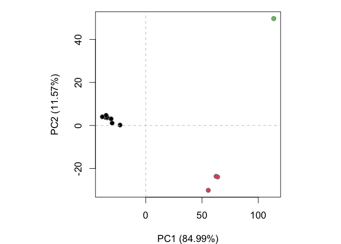
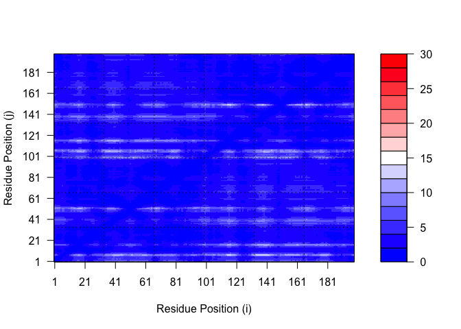

# class11 structural bioinformatics p2
amy (pid A16962111)

## comparative structure analysis of adenylate kinase

Here we will perform PCA on all of the adenylate kinase (Adk) structures
in the PDB using the bio3d function `pca()`

``` r
#install.packages("bio3d")
#install.packages("devtools")
#install.packages("BiocManager")

#BiocManager::install("msa")
#devtools::install_bitbucket("Grantlab/bio3d-view")
```

Use `get.seq()` to retrieve a query sequence (chain A of one Adk)

``` r
library(bio3d)
aa <- get.seq("1ake_A")
```

    Warning in get.seq("1ake_A"): Removing existing file: seqs.fasta

    Fetching... Please wait. Done.

BLAST search:

``` r
#b <- blast.pdb(aa)
#hits <- plot(b)
#head(hits$pdb.id)
```

``` r
hits <- NULL
hits$pdb.id <- c('1AKE_A','6S36_A','6RZE_A','3HPR_A','1E4V_A','5EJE_A','1E4Y_A','3X2S_A','6HAP_A','6HAM_A','4K46_A','3GMT_A','4PZL_A')
files <- get.pdb(hits$pdb.id, path="pdbs", split=TRUE, gzip=TRUE)
```

    Warning in get.pdb(hits$pdb.id, path = "pdbs", split = TRUE, gzip = TRUE):
    pdbs/1AKE.pdb.gz exists. Skipping download

    Warning in get.pdb(hits$pdb.id, path = "pdbs", split = TRUE, gzip = TRUE):
    pdbs/6S36.pdb.gz exists. Skipping download

    Warning in get.pdb(hits$pdb.id, path = "pdbs", split = TRUE, gzip = TRUE):
    pdbs/6RZE.pdb.gz exists. Skipping download

    Warning in get.pdb(hits$pdb.id, path = "pdbs", split = TRUE, gzip = TRUE):
    pdbs/3HPR.pdb.gz exists. Skipping download

    Warning in get.pdb(hits$pdb.id, path = "pdbs", split = TRUE, gzip = TRUE):
    pdbs/1E4V.pdb.gz exists. Skipping download

    Warning in get.pdb(hits$pdb.id, path = "pdbs", split = TRUE, gzip = TRUE):
    pdbs/5EJE.pdb.gz exists. Skipping download

    Warning in get.pdb(hits$pdb.id, path = "pdbs", split = TRUE, gzip = TRUE):
    pdbs/1E4Y.pdb.gz exists. Skipping download

    Warning in get.pdb(hits$pdb.id, path = "pdbs", split = TRUE, gzip = TRUE):
    pdbs/3X2S.pdb.gz exists. Skipping download

    Warning in get.pdb(hits$pdb.id, path = "pdbs", split = TRUE, gzip = TRUE):
    pdbs/6HAP.pdb.gz exists. Skipping download

    Warning in get.pdb(hits$pdb.id, path = "pdbs", split = TRUE, gzip = TRUE):
    pdbs/6HAM.pdb.gz exists. Skipping download

    Warning in get.pdb(hits$pdb.id, path = "pdbs", split = TRUE, gzip = TRUE):
    pdbs/4K46.pdb.gz exists. Skipping download

    Warning in get.pdb(hits$pdb.id, path = "pdbs", split = TRUE, gzip = TRUE):
    pdbs/3GMT.pdb.gz exists. Skipping download

    Warning in get.pdb(hits$pdb.id, path = "pdbs", split = TRUE, gzip = TRUE):
    pdbs/4PZL.pdb.gz exists. Skipping download


      |                                                                            
      |                                                                      |   0%
      |                                                                            
      |=====                                                                 |   8%
      |                                                                            
      |===========                                                           |  15%
      |                                                                            
      |================                                                      |  23%
      |                                                                            
      |======================                                                |  31%
      |                                                                            
      |===========================                                           |  38%
      |                                                                            
      |================================                                      |  46%
      |                                                                            
      |======================================                                |  54%
      |                                                                            
      |===========================================                           |  62%
      |                                                                            
      |================================================                      |  69%
      |                                                                            
      |======================================================                |  77%
      |                                                                            
      |===========================================================           |  85%
      |                                                                            
      |=================================================================     |  92%
      |                                                                            
      |======================================================================| 100%

Use function `pdbaln()` to align and superpose (“fit”) 13 identified
related structures.

``` r
pdbs <- pdbaln(files, fit = TRUE, exefile="msa")
```

    Reading PDB files:
    pdbs/split_chain/1AKE_A.pdb
    pdbs/split_chain/6S36_A.pdb
    pdbs/split_chain/6RZE_A.pdb
    pdbs/split_chain/3HPR_A.pdb
    pdbs/split_chain/1E4V_A.pdb
    pdbs/split_chain/5EJE_A.pdb
    pdbs/split_chain/1E4Y_A.pdb
    pdbs/split_chain/3X2S_A.pdb
    pdbs/split_chain/6HAP_A.pdb
    pdbs/split_chain/6HAM_A.pdb
    pdbs/split_chain/4K46_A.pdb
    pdbs/split_chain/3GMT_A.pdb
    pdbs/split_chain/4PZL_A.pdb
       PDB has ALT records, taking A only, rm.alt=TRUE
    .   PDB has ALT records, taking A only, rm.alt=TRUE
    .   PDB has ALT records, taking A only, rm.alt=TRUE
    .   PDB has ALT records, taking A only, rm.alt=TRUE
    ..   PDB has ALT records, taking A only, rm.alt=TRUE
    ....   PDB has ALT records, taking A only, rm.alt=TRUE
    .   PDB has ALT records, taking A only, rm.alt=TRUE
    ...

    Extracting sequences

    pdb/seq: 1   name: pdbs/split_chain/1AKE_A.pdb 
       PDB has ALT records, taking A only, rm.alt=TRUE
    pdb/seq: 2   name: pdbs/split_chain/6S36_A.pdb 
       PDB has ALT records, taking A only, rm.alt=TRUE
    pdb/seq: 3   name: pdbs/split_chain/6RZE_A.pdb 
       PDB has ALT records, taking A only, rm.alt=TRUE
    pdb/seq: 4   name: pdbs/split_chain/3HPR_A.pdb 
       PDB has ALT records, taking A only, rm.alt=TRUE
    pdb/seq: 5   name: pdbs/split_chain/1E4V_A.pdb 
    pdb/seq: 6   name: pdbs/split_chain/5EJE_A.pdb 
       PDB has ALT records, taking A only, rm.alt=TRUE
    pdb/seq: 7   name: pdbs/split_chain/1E4Y_A.pdb 
    pdb/seq: 8   name: pdbs/split_chain/3X2S_A.pdb 
    pdb/seq: 9   name: pdbs/split_chain/6HAP_A.pdb 
    pdb/seq: 10   name: pdbs/split_chain/6HAM_A.pdb 
       PDB has ALT records, taking A only, rm.alt=TRUE
    pdb/seq: 11   name: pdbs/split_chain/4K46_A.pdb 
       PDB has ALT records, taking A only, rm.alt=TRUE
    pdb/seq: 12   name: pdbs/split_chain/3GMT_A.pdb 
    pdb/seq: 13   name: pdbs/split_chain/4PZL_A.pdb 

``` r
ids <- basename.pdb(pdbs$id)
#plot(pdbs, labels=ids)
```

Use function `pdb.annotate()` to annotate each structure to its source
species.

``` r
anno <- pdb.annotate(ids)
unique(anno$source)
```

    [1] "Escherichia coli"                                
    [2] "Escherichia coli K-12"                           
    [3] "Escherichia coli O139:H28 str. E24377A"          
    [4] "Escherichia coli str. K-12 substr. MDS42"        
    [5] "Photobacterium profundum"                        
    [6] "Burkholderia pseudomallei 1710b"                 
    [7] "Francisella tularensis subsp. tularensis SCHU S4"

``` r
anno
```

           structureId chainId macromoleculeType chainLength experimentalTechnique
    1AKE_A        1AKE       A           Protein         214                 X-ray
    6S36_A        6S36       A           Protein         214                 X-ray
    6RZE_A        6RZE       A           Protein         214                 X-ray
    3HPR_A        3HPR       A           Protein         214                 X-ray
    1E4V_A        1E4V       A           Protein         214                 X-ray
    5EJE_A        5EJE       A           Protein         214                 X-ray
    1E4Y_A        1E4Y       A           Protein         214                 X-ray
    3X2S_A        3X2S       A           Protein         214                 X-ray
    6HAP_A        6HAP       A           Protein         214                 X-ray
    6HAM_A        6HAM       A           Protein         214                 X-ray
    4K46_A        4K46       A           Protein         214                 X-ray
    3GMT_A        3GMT       A           Protein         230                 X-ray
    4PZL_A        4PZL       A           Protein         242                 X-ray
           resolution       scopDomain                                        pfam
    1AKE_A       2.00 Adenylate kinase                      Adenylate kinase (ADK)
    6S36_A       1.60             <NA>                      Adenylate kinase (ADK)
    6RZE_A       1.69             <NA> Adenylate kinase, active site lid (ADK_lid)
    3HPR_A       2.00             <NA>                      Adenylate kinase (ADK)
    1E4V_A       1.85 Adenylate kinase Adenylate kinase, active site lid (ADK_lid)
    5EJE_A       1.90             <NA>                      Adenylate kinase (ADK)
    1E4Y_A       1.85 Adenylate kinase Adenylate kinase, active site lid (ADK_lid)
    3X2S_A       2.80             <NA>                      Adenylate kinase (ADK)
    6HAP_A       2.70             <NA>                      Adenylate kinase (ADK)
    6HAM_A       2.55             <NA> Adenylate kinase, active site lid (ADK_lid)
    4K46_A       2.01             <NA> Adenylate kinase, active site lid (ADK_lid)
    3GMT_A       2.10             <NA>                      Adenylate kinase (ADK)
    4PZL_A       2.10             <NA> Adenylate kinase, active site lid (ADK_lid)
                   ligandId
    1AKE_A              AP5
    6S36_A NA,MG (2),CL (3)
    6RZE_A    NA (3),CL (2)
    3HPR_A              AP5
    1E4V_A              AP5
    5EJE_A           AP5,CO
    1E4Y_A              AP5
    3X2S_A   JPY (2),AP5,MG
    6HAP_A              AP5
    6HAM_A              AP5
    4K46_A      ADP,AMP,PO4
    3GMT_A          SO4 (2)
    4PZL_A       CA,FMT,GOL
                                                                                 ligandName
    1AKE_A                                                 BIS(ADENOSINE)-5'-PENTAPHOSPHATE
    6S36_A                                    SODIUM ION,MAGNESIUM ION (2),CHLORIDE ION (3)
    6RZE_A                                                  SODIUM ION (3),CHLORIDE ION (2)
    3HPR_A                                                 BIS(ADENOSINE)-5'-PENTAPHOSPHATE
    1E4V_A                                                 BIS(ADENOSINE)-5'-PENTAPHOSPHATE
    5EJE_A                                 BIS(ADENOSINE)-5'-PENTAPHOSPHATE,COBALT (II) ION
    1E4Y_A                                                 BIS(ADENOSINE)-5'-PENTAPHOSPHATE
    3X2S_A N-(pyren-1-ylmethyl)acetamide (2),BIS(ADENOSINE)-5'-PENTAPHOSPHATE,MAGNESIUM ION
    6HAP_A                                                 BIS(ADENOSINE)-5'-PENTAPHOSPHATE
    6HAM_A                                                 BIS(ADENOSINE)-5'-PENTAPHOSPHATE
    4K46_A                   ADENOSINE-5'-DIPHOSPHATE,ADENOSINE MONOPHOSPHATE,PHOSPHATE ION
    3GMT_A                                                                  SULFATE ION (2)
    4PZL_A                                                 CALCIUM ION,FORMIC ACID,GLYCEROL
                                                     source
    1AKE_A                                 Escherichia coli
    6S36_A                                 Escherichia coli
    6RZE_A                                 Escherichia coli
    3HPR_A                            Escherichia coli K-12
    1E4V_A                                 Escherichia coli
    5EJE_A           Escherichia coli O139:H28 str. E24377A
    1E4Y_A                                 Escherichia coli
    3X2S_A         Escherichia coli str. K-12 substr. MDS42
    6HAP_A           Escherichia coli O139:H28 str. E24377A
    6HAM_A                            Escherichia coli K-12
    4K46_A                         Photobacterium profundum
    3GMT_A                  Burkholderia pseudomallei 1710b
    4PZL_A Francisella tularensis subsp. tularensis SCHU S4
                                                                                                                                                                         structureTitle
    1AKE_A STRUCTURE OF THE COMPLEX BETWEEN ADENYLATE KINASE FROM ESCHERICHIA COLI AND THE INHIBITOR AP5A REFINED AT 1.9 ANGSTROMS RESOLUTION: A MODEL FOR A CATALYTIC TRANSITION STATE
    6S36_A                                                                                                                   Crystal structure of E. coli Adenylate kinase R119K mutant
    6RZE_A                                                                                                                   Crystal structure of E. coli Adenylate kinase R119A mutant
    3HPR_A                                                                                               Crystal structure of V148G adenylate kinase from E. coli, in complex with Ap5A
    1E4V_A                                                                                                       Mutant G10V of adenylate kinase from E. coli, modified in the Gly-loop
    5EJE_A                                                                                  Crystal structure of E. coli Adenylate kinase G56C/T163C double mutant in complex with Ap5a
    1E4Y_A                                                                                                        Mutant P9L of adenylate kinase from E. coli, modified in the Gly-loop
    3X2S_A                                                                                                                      Crystal structure of pyrene-conjugated adenylate kinase
    6HAP_A                                                                                                                                                             Adenylate kinase
    6HAM_A                                                                                                                                                             Adenylate kinase
    4K46_A                                                                                                          Crystal Structure of Adenylate Kinase from Photobacterium profundum
    3GMT_A                                                                                                         Crystal structure of adenylate kinase from burkholderia pseudomallei
    4PZL_A                                                                              The crystal structure of adenylate kinase from Francisella tularensis subsp. tularensis SCHU S4
                                                         citation rObserved   rFree
    1AKE_A                 Muller, C.W., et al. J Mol Biol (1992)   0.19600      NA
    6S36_A                  Rogne, P., et al. Biochemistry (2019)   0.16320 0.23560
    6RZE_A                  Rogne, P., et al. Biochemistry (2019)   0.18650 0.23500
    3HPR_A  Schrank, T.P., et al. Proc Natl Acad Sci U S A (2009)   0.21000 0.24320
    1E4V_A                   Muller, C.W., et al. Proteins (1993)   0.19600      NA
    5EJE_A  Kovermann, M., et al. Proc Natl Acad Sci U S A (2017)   0.18890 0.23580
    1E4Y_A                   Muller, C.W., et al. Proteins (1993)   0.17800      NA
    3X2S_A                Fujii, A., et al. Bioconjug Chem (2015)   0.20700 0.25600
    6HAP_A               Kantaev, R., et al. J Phys Chem B (2018)   0.22630 0.27760
    6HAM_A               Kantaev, R., et al. J Phys Chem B (2018)   0.20511 0.24325
    4K46_A                    Cho, Y.-J., et al. To be published    0.17000 0.22290
    3GMT_A Buchko, G.W., et al. Biochem Biophys Res Commun (2010)   0.23800 0.29500
    4PZL_A                       Tan, K., et al. To be published    0.19360 0.23680
             rWork spaceGroup
    1AKE_A 0.19600  P 21 2 21
    6S36_A 0.15940    C 1 2 1
    6RZE_A 0.18190    C 1 2 1
    3HPR_A 0.20620  P 21 21 2
    1E4V_A 0.19600  P 21 2 21
    5EJE_A 0.18630  P 21 2 21
    1E4Y_A 0.17800   P 1 21 1
    3X2S_A 0.20700 P 21 21 21
    6HAP_A 0.22370    I 2 2 2
    6HAM_A 0.20311       P 43
    4K46_A 0.16730 P 21 21 21
    3GMT_A 0.23500   P 1 21 1
    4PZL_A 0.19130       P 32

Perform PCA

``` r
pc.xray <- pca(pdbs)
plot(pc.xray)
```


Use `rmsd()` to cluster structures based on their pairwise structural
deviation

``` r
rd <- rmsd(pdbs)
```

    Warning in rmsd(pdbs): No indices provided, using the 204 non NA positions

``` r
hc.rd <- hclust(dist(rd))
grps.rd <- cutree(hc.rd, k=3)

plot(pc.xray, 1:2, col="grey50", bg=grps.rd, pch=21, cex=1)
```



## custom analysis of ColabFold models

Here we will perform a custom analysis on the results of running
ColabFold on the following protein sequence query:

> \>HIV-Pr-Dimer
> PQITLWQRPLVTIKIGGQLKEALLDTGADDTVLEEMSLPGRWKPKMIGGIGGFIKVRQYD
> QILIEICGHKAIGTVLVGPTPVNIIGRNLLTQIGCTLNF:PQITLWQRPLVTIKIGGQLK
> EALLDTGADDTVLEEMSLPGRWKPKMIGGIGGFIKVRQYDQILIEICGHKAIGTVLVGPT
> PVNIIGRNLLTQIGCTLNF

``` r
results_dir <- "HIVPrDimer_23119"
pdb_files <- list.files(path=results_dir,
                        pattern="*.pdb",
                        full.names = TRUE)
basename(pdb_files)
```

    [1] "HIVPrDimer_23119_unrelaxed_rank_001_alphafold2_multimer_v3_model_1_seed_000.pdb"
    [2] "HIVPrDimer_23119_unrelaxed_rank_002_alphafold2_multimer_v3_model_5_seed_000.pdb"
    [3] "HIVPrDimer_23119_unrelaxed_rank_003_alphafold2_multimer_v3_model_4_seed_000.pdb"
    [4] "HIVPrDimer_23119_unrelaxed_rank_004_alphafold2_multimer_v3_model_2_seed_000.pdb"
    [5] "HIVPrDimer_23119_unrelaxed_rank_005_alphafold2_multimer_v3_model_3_seed_000.pdb"

``` r
pdbs <- pdbaln(pdb_files, fit=TRUE, exefile="msa")
```

    Reading PDB files:
    HIVPrDimer_23119/HIVPrDimer_23119_unrelaxed_rank_001_alphafold2_multimer_v3_model_1_seed_000.pdb
    HIVPrDimer_23119/HIVPrDimer_23119_unrelaxed_rank_002_alphafold2_multimer_v3_model_5_seed_000.pdb
    HIVPrDimer_23119/HIVPrDimer_23119_unrelaxed_rank_003_alphafold2_multimer_v3_model_4_seed_000.pdb
    HIVPrDimer_23119/HIVPrDimer_23119_unrelaxed_rank_004_alphafold2_multimer_v3_model_2_seed_000.pdb
    HIVPrDimer_23119/HIVPrDimer_23119_unrelaxed_rank_005_alphafold2_multimer_v3_model_3_seed_000.pdb
    .....

    Extracting sequences

    pdb/seq: 1   name: HIVPrDimer_23119/HIVPrDimer_23119_unrelaxed_rank_001_alphafold2_multimer_v3_model_1_seed_000.pdb 
    pdb/seq: 2   name: HIVPrDimer_23119/HIVPrDimer_23119_unrelaxed_rank_002_alphafold2_multimer_v3_model_5_seed_000.pdb 
    pdb/seq: 3   name: HIVPrDimer_23119/HIVPrDimer_23119_unrelaxed_rank_003_alphafold2_multimer_v3_model_4_seed_000.pdb 
    pdb/seq: 4   name: HIVPrDimer_23119/HIVPrDimer_23119_unrelaxed_rank_004_alphafold2_multimer_v3_model_2_seed_000.pdb 
    pdb/seq: 5   name: HIVPrDimer_23119/HIVPrDimer_23119_unrelaxed_rank_005_alphafold2_multimer_v3_model_3_seed_000.pdb 

``` r
pdbs
```

                                   1        .         .         .         .         50 
    [Truncated_Name:1]HIVPrDimer   PQITLWQRPLVTIKIGGQLKEALLDTGADDTVLEEMSLPGRWKPKMIGGI
    [Truncated_Name:2]HIVPrDimer   PQITLWQRPLVTIKIGGQLKEALLDTGADDTVLEEMSLPGRWKPKMIGGI
    [Truncated_Name:3]HIVPrDimer   PQITLWQRPLVTIKIGGQLKEALLDTGADDTVLEEMSLPGRWKPKMIGGI
    [Truncated_Name:4]HIVPrDimer   PQITLWQRPLVTIKIGGQLKEALLDTGADDTVLEEMSLPGRWKPKMIGGI
    [Truncated_Name:5]HIVPrDimer   PQITLWQRPLVTIKIGGQLKEALLDTGADDTVLEEMSLPGRWKPKMIGGI
                                   ************************************************** 
                                   1        .         .         .         .         50 

                                  51        .         .         .         .         100 
    [Truncated_Name:1]HIVPrDimer   GGFIKVRQYDQILIEICGHKAIGTVLVGPTPVNIIGRNLLTQIGCTLNFP
    [Truncated_Name:2]HIVPrDimer   GGFIKVRQYDQILIEICGHKAIGTVLVGPTPVNIIGRNLLTQIGCTLNFP
    [Truncated_Name:3]HIVPrDimer   GGFIKVRQYDQILIEICGHKAIGTVLVGPTPVNIIGRNLLTQIGCTLNFP
    [Truncated_Name:4]HIVPrDimer   GGFIKVRQYDQILIEICGHKAIGTVLVGPTPVNIIGRNLLTQIGCTLNFP
    [Truncated_Name:5]HIVPrDimer   GGFIKVRQYDQILIEICGHKAIGTVLVGPTPVNIIGRNLLTQIGCTLNFP
                                   ************************************************** 
                                  51        .         .         .         .         100 

                                 101        .         .         .         .         150 
    [Truncated_Name:1]HIVPrDimer   QITLWQRPLVTIKIGGQLKEALLDTGADDTVLEEMSLPGRWKPKMIGGIG
    [Truncated_Name:2]HIVPrDimer   QITLWQRPLVTIKIGGQLKEALLDTGADDTVLEEMSLPGRWKPKMIGGIG
    [Truncated_Name:3]HIVPrDimer   QITLWQRPLVTIKIGGQLKEALLDTGADDTVLEEMSLPGRWKPKMIGGIG
    [Truncated_Name:4]HIVPrDimer   QITLWQRPLVTIKIGGQLKEALLDTGADDTVLEEMSLPGRWKPKMIGGIG
    [Truncated_Name:5]HIVPrDimer   QITLWQRPLVTIKIGGQLKEALLDTGADDTVLEEMSLPGRWKPKMIGGIG
                                   ************************************************** 
                                 101        .         .         .         .         150 

                                 151        .         .         .         .       198 
    [Truncated_Name:1]HIVPrDimer   GFIKVRQYDQILIEICGHKAIGTVLVGPTPVNIIGRNLLTQIGCTLNF
    [Truncated_Name:2]HIVPrDimer   GFIKVRQYDQILIEICGHKAIGTVLVGPTPVNIIGRNLLTQIGCTLNF
    [Truncated_Name:3]HIVPrDimer   GFIKVRQYDQILIEICGHKAIGTVLVGPTPVNIIGRNLLTQIGCTLNF
    [Truncated_Name:4]HIVPrDimer   GFIKVRQYDQILIEICGHKAIGTVLVGPTPVNIIGRNLLTQIGCTLNF
    [Truncated_Name:5]HIVPrDimer   GFIKVRQYDQILIEICGHKAIGTVLVGPTPVNIIGRNLLTQIGCTLNF
                                   ************************************************ 
                                 151        .         .         .         .       198 

    Call:
      pdbaln(files = pdb_files, fit = TRUE, exefile = "msa")

    Class:
      pdbs, fasta

    Alignment dimensions:
      5 sequence rows; 198 position columns (198 non-gap, 0 gap) 

    + attr: xyz, resno, b, chain, id, ali, resid, sse, call

``` r
rd <- rmsd(pdbs, fit=T)
```

    Warning in rmsd(pdbs, fit = T): No indices provided, using the 198 non NA positions

``` r
range(rd)
```

    [1]  0.000 14.631

Create a heatmap of RMSD matrix values

``` r
#install.packages("pheatmap")
library(pheatmap)
colnames(rd) <- paste0("m",1:5)
rownames(rd) <- paste0("m",1:5)
pheatmap(rd)
```


Based on this plot, models 1 and 2 are the most similar, and models 1
and 5 are the most dissimilar.

Next, plot pLDDT values across all models (saved in `pdbs$b` )

``` r
# Read a reference PDB structure
pdb <- read.pdb("1hsg")
```

      Note: Accessing on-line PDB file

``` r
plotb3(pdbs$b[1,], typ="l", lwd=2, sse=pdb)
points(pdbs$b[2,], typ="l", col="red")
points(pdbs$b[3,], typ="l", col="blue")
points(pdbs$b[4,], typ="l", col="darkgreen")
points(pdbs$b[5,], typ="l", col="orange")
abline(v=100, col="gray")
```


We can improve superposition by finding the most consistent “rigid core”
common across all the models using `core.find()`

``` r
core <- core.find(pdbs)
```

     core size 197 of 198  vol = 4578.336 
     core size 196 of 198  vol = 3931.103 
     core size 195 of 198  vol = 3709.727 
     core size 194 of 198  vol = 3496.014 
     core size 193 of 198  vol = 3302.428 
     core size 192 of 198  vol = 3146.468 
     core size 191 of 198  vol = 3048.959 
     core size 190 of 198  vol = 2970.348 
     core size 189 of 198  vol = 2893.007 
     core size 188 of 198  vol = 2831.818 
     core size 187 of 198  vol = 2774.499 
     core size 186 of 198  vol = 2728.035 
     core size 185 of 198  vol = 2704.937 
     core size 184 of 198  vol = 2701.97 
     core size 183 of 198  vol = 2715.897 
     core size 182 of 198  vol = 2809.84 
     core size 181 of 198  vol = 2888.937 
     core size 180 of 198  vol = 2967.269 
     core size 179 of 198  vol = 3036.243 
     core size 178 of 198  vol = 3066.274 
     core size 177 of 198  vol = 3096.82 
     core size 176 of 198  vol = 3056.401 
     core size 175 of 198  vol = 3014.755 
     core size 174 of 198  vol = 2974.999 
     core size 173 of 198  vol = 2898.037 
     core size 172 of 198  vol = 2810.159 
     core size 171 of 198  vol = 2747.518 
     core size 170 of 198  vol = 2684.42 
     core size 169 of 198  vol = 2620.339 
     core size 168 of 198  vol = 2550.863 
     core size 167 of 198  vol = 2492.567 
     core size 166 of 198  vol = 2422.963 
     core size 165 of 198  vol = 2358.901 
     core size 164 of 198  vol = 2298.277 
     core size 163 of 198  vol = 2235.903 
     core size 162 of 198  vol = 2171.006 
     core size 161 of 198  vol = 2093.544 
     core size 160 of 198  vol = 2029.129 
     core size 159 of 198  vol = 1950.943 
     core size 158 of 198  vol = 1881.001 
     core size 157 of 198  vol = 1801.491 
     core size 156 of 198  vol = 1728.877 
     core size 155 of 198  vol = 1660.022 
     core size 154 of 198  vol = 1586.134 
     core size 153 of 198  vol = 1532.702 
     core size 152 of 198  vol = 1460.171 
     core size 151 of 198  vol = 1399.236 
     core size 150 of 198  vol = 1333.893 
     core size 149 of 198  vol = 1271.731 
     core size 148 of 198  vol = 1219.48 
     core size 147 of 198  vol = 1175.987 
     core size 146 of 198  vol = 1138.462 
     core size 145 of 198  vol = 1102.108 
     core size 144 of 198  vol = 1049.627 
     core size 143 of 198  vol = 1014.047 
     core size 142 of 198  vol = 970.56 
     core size 141 of 198  vol = 929.163 
     core size 140 of 198  vol = 889.089 
     core size 139 of 198  vol = 846.653 
     core size 138 of 198  vol = 805.785 
     core size 137 of 198  vol = 775.019 
     core size 136 of 198  vol = 743.075 
     core size 135 of 198  vol = 715.68 
     core size 134 of 198  vol = 689.773 
     core size 133 of 198  vol = 660.314 
     core size 132 of 198  vol = 630.951 
     core size 131 of 198  vol = 597.191 
     core size 130 of 198  vol = 566.973 
     core size 129 of 198  vol = 532.874 
     core size 128 of 198  vol = 496.192 
     core size 127 of 198  vol = 463.167 
     core size 126 of 198  vol = 431.877 
     core size 125 of 198  vol = 408.848 
     core size 124 of 198  vol = 376.594 
     core size 123 of 198  vol = 362.36 
     core size 122 of 198  vol = 353.633 
     core size 121 of 198  vol = 331.501 
     core size 120 of 198  vol = 312.518 
     core size 119 of 198  vol = 286.715 
     core size 118 of 198  vol = 262.336 
     core size 117 of 198  vol = 245.109 
     core size 116 of 198  vol = 228.342 
     core size 115 of 198  vol = 210.366 
     core size 114 of 198  vol = 197.519 
     core size 113 of 198  vol = 179.392 
     core size 112 of 198  vol = 161.891 
     core size 111 of 198  vol = 148.359 
     core size 110 of 198  vol = 134.477 
     core size 109 of 198  vol = 121.261 
     core size 108 of 198  vol = 109.516 
     core size 107 of 198  vol = 103.031 
     core size 106 of 198  vol = 96.443 
     core size 105 of 198  vol = 88.455 
     core size 104 of 198  vol = 81.816 
     core size 103 of 198  vol = 74.88 
     core size 102 of 198  vol = 68.386 
     core size 101 of 198  vol = 65.937 
     core size 100 of 198  vol = 62.345 
     core size 99 of 198  vol = 58.836 
     core size 98 of 198  vol = 52.868 
     core size 97 of 198  vol = 47.796 
     core size 96 of 198  vol = 41.292 
     core size 95 of 198  vol = 33.831 
     core size 94 of 198  vol = 24.912 
     core size 93 of 198  vol = 18.912 
     core size 92 of 198  vol = 12.7 
     core size 91 of 198  vol = 7.35 
     core size 90 of 198  vol = 4.922 
     core size 89 of 198  vol = 3.421 
     core size 88 of 198  vol = 2.553 
     core size 87 of 198  vol = 1.917 
     core size 86 of 198  vol = 1.513 
     core size 85 of 198  vol = 1.201 
     core size 84 of 198  vol = 1.046 
     core size 83 of 198  vol = 0.922 
     core size 82 of 198  vol = 0.755 
     core size 81 of 198  vol = 0.668 
     core size 80 of 198  vol = 0.596 
     core size 79 of 198  vol = 0.549 
     core size 78 of 198  vol = 0.493 
     FINISHED: Min vol ( 0.5 ) reached

``` r
core.inds <- print(core, vol=0.5)
```

    # 79 positions (cumulative volume <= 0.5 Angstrom^3) 
      start end length
    1    10  25     16
    2    28  48     21
    3    53  94     42

``` r
xyz <- pdbfit(pdbs, core.inds, outpath="corefit_structures")
```

Open the models with new superposition coordinates in Mol\* and color by
pLDDT scores:


Examine RMSF, a measure of conformational variance, between positions of
the structure.

``` r
rf <- rmsf(xyz)

plotb3(rf, sse=pdb)
abline(v=100, col="gray", ylab="RMSF")
```


The first chain (left of residue 100) is more similar across models than
chain 2.

### predicted alignment error (PAE) for domains

``` r
library(jsonlite)

pae_files <- list.files(path=results_dir,
                        pattern=".*model.*\\.json",
                        full.names = TRUE)

pae1 <- read_json(pae_files[1],simplifyVector = TRUE)
pae5 <- read_json(pae_files[5],simplifyVector = TRUE)

attributes(pae1)
```

    $names
    [1] "plddt"   "max_pae" "pae"     "ptm"     "iptm"   

``` r
head(pae1$plddt)
```

    [1] 87.81 92.00 91.81 91.88 94.25 88.00

Lower PAE scores indicate a better model. Model 1 is better than model
5.

``` r
pae1$max_pae
```

    [1] 14.09375

``` r
pae5$max_pae
```

    [1] 29.29688

Plot the N by N (where N is the number of residues) PAE scores

Model1

``` r
plot.dmat(pae1$pae, 
          xlab="Residue Position (i)",
          ylab="Residue Position (j)",
          grid.col = "black",
          zlim=c(0,30))
```



Model5

``` r
plot.dmat(pae5$pae, 
          xlab="Residue Position (i)",
          ylab="Residue Position (j)",
          grid.col = "black",
          zlim=c(0,30))
```


We can see that the PAE scores for model 5 are high for residue
positions i 101-200 vs j 1-100 and vice versa, meaning that model 5 does
a poor job of predicting the alignment of the two chains with respect to
each other.

### residue conservation from alignment file

``` r
aln_file <- list.files(path=results_dir,
                       pattern=".a3m$",
                        full.names = TRUE)
aln_file
```

    [1] "HIVPrDimer_23119/HIVPrDimer_23119.a3m"

``` r
aln <- read.fasta(aln_file[1], to.upper = TRUE)
```

    [1] " ** Duplicated sequence id's: 101 **"
    [2] " ** Duplicated sequence id's: 101 **"

How many sequences are in this alignment?

5378 sequences

``` r
dim(aln$ali)
```

    [1] 5378  132

Use function `conserv()` to score residue conservation

``` r
sim <- conserv(aln)
plotb3(sim[1:99], sse=trim.pdb(pdb, chain="A"),
       ylab="Conservation Score")
```


The highest conservation scores are for residues 25-28

``` r
con <- consensus(aln, cutoff = 0.9)
con$seq
```

      [1] "-" "-" "-" "-" "-" "-" "-" "-" "-" "-" "-" "-" "-" "-" "-" "-" "-" "-"
     [19] "-" "-" "-" "-" "-" "-" "D" "T" "G" "A" "-" "-" "-" "-" "-" "-" "-" "-"
     [37] "-" "-" "-" "-" "-" "-" "-" "-" "-" "-" "-" "-" "-" "-" "-" "-" "-" "-"
     [55] "-" "-" "-" "-" "-" "-" "-" "-" "-" "-" "-" "-" "-" "-" "-" "-" "-" "-"
     [73] "-" "-" "-" "-" "-" "-" "-" "-" "-" "-" "-" "-" "-" "-" "-" "-" "-" "-"
     [91] "-" "-" "-" "-" "-" "-" "-" "-" "-" "-" "-" "-" "-" "-" "-" "-" "-" "-"
    [109] "-" "-" "-" "-" "-" "-" "-" "-" "-" "-" "-" "-" "-" "-" "-" "-" "-" "-"
    [127] "-" "-" "-" "-" "-" "-"

To highlight these conserved residues (like have functional importance):

``` r
m1.pdb <- read.pdb(pdb_files[1])
occ <- vec2resno(c(sim[1:99], sim[1:99]), m1.pdb$atom$resno)
write.pdb(m1.pdb, o=occ, file="m1_conserv.pdb")
```

View in Mol\* and color by occupancy. The dark purple region shows the
active site.


